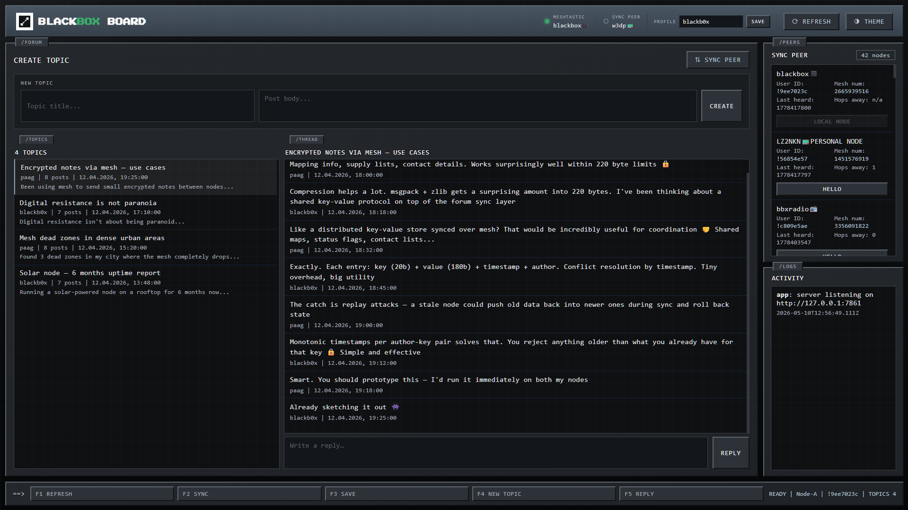

# Blackbox Board

A decentralized forum that runs entirely over [Meshtastic](https://meshtastic.org/) LoRa mesh radio — no internet, no servers, no cloud. Nodes talk directly to each other via USB-connected LoRa devices.



---

## How It Works

Each instance of Blackbox Board is an independent node. Nodes discover each other through the mesh network and synchronize their forum state peer-to-peer.

**Communication stack:**

```
Browser (Vanilla JS)
     ↕  REST API (polling every 5s)
Node.js HTTP server  (server.js)
     ↕  JSON lines over stdin/stdout
Python serial bridge  (bridge.py)
     ↕  USB serial
Meshtastic LoRa device
     ↕  915 / 868 MHz radio
Remote Meshtastic device  →  Remote node
```

**Protocol highlights:**

- Forum messages are encoded in a compact format (`mf1`) to fit within LoRa's ~220-byte MTU
- Messages larger than the safe payload size are chunked and reassembled automatically
- A two-phase sync handshake (`sync_offer → sync_turn → sync_done`) avoids sending data the peer already has
- Each node tracks peer knowledge to minimize redundant transmissions
- Forum state is persisted to JSON files and survives restarts

---

## Requirements

| Component | Version |
|-----------|---------|
| Node.js | 14 or later |
| Python | 3.11 or later |
| Meshtastic Python lib | `pip install meshtastic` |
| Hardware | 1–2 USB Meshtastic LoRa modules |

---

## Quick Start

### Single node (one LoRa device)

```bash
npm install
npm run start-single
```

Opens at `http://127.0.0.1:7861`

### Two nodes (two LoRa devices, or testing)

```bash
npm run start
```

- Node A → `http://127.0.0.1:7861`
- Node B → `http://127.0.0.1:7862`

---

## Testing Without Hardware

You can test the UI and forum logic without physical LoRa hardware by running two nodes locally. The bridge will report that no device is detected, but the forum, topics, posts, and sync UI all work normally — you just won't have radio transmission.

To simulate a full sync between two local nodes:

1. `npm run start` — starts both nodes
2. Open `http://127.0.0.1:7861` and `http://127.0.0.1:7862` in separate tabs
3. Create topics and posts on one node
4. Trigger a sync from the other node's sidebar

For performance testing:

```bash
node test-sync-performance.js
```

---

## Environment Variables

| Variable | Default | Description |
|----------|---------|-------------|
| `PORT` | `7861` | HTTP server port |
| `DATA_DIR` | `./data` | Directory for persistent JSON state |
| `INSTANCE_LABEL` | — | Display name shown in the UI |
| `MESHTASTIC_PORT` | auto-detect | Explicit serial port path |
| `MESH_PORT_INDEX` | `0` | Index for auto-detected port (0 or 1) |
| `FORUM_CHUNK_SIZE` | `150` | Chunking hint in bytes |
| `MESH_TEXT_PAYLOAD_MAX_BYTES` | `220` | LoRa packet size cap |
| `NO_OPEN_BROWSER` | — | Set to any value to suppress auto-open |

---

## UI Controls

| Key | Action |
|-----|--------|
| F1 | New Topic |
| F2 | Forum view |
| F3 | Sync peers |
| F4 | Logs |
| F5 | Settings |
| `T` | Toggle dark/light theme |

---

## Data Layout

```
data/
  forum.json          # Topics, posts, seen envelope IDs
  bootstrap.json      # Selected peer, hello state, peer knowledge
  local-identity.json # Ed25519 key pair + author ID
  logs.jsonl          # Append-only event log
```

---

## License

[MIT](LICENSE)
